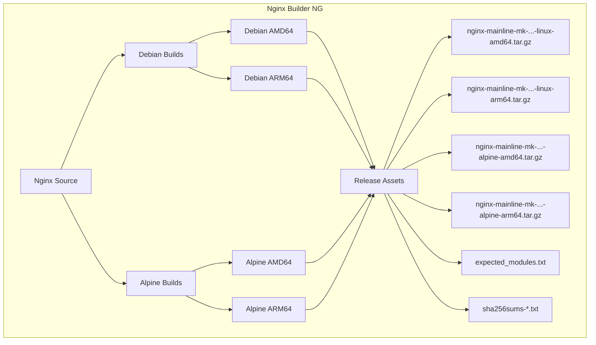

# Nginx Builder NG (Next Generation)

> **The engine room for the modern Nginx Proxy Manager ecosystem.**

[](https://github.com/markd3ng/nginx-builder-ng/actions)

**nginx-builder-ng** is a specialized build system that compiles a "fat" Nginx binary from source. It is designed to provide a feature-rich, high-performance Nginx core for downstream projects like [nginx-proxy-manager-app](https://github.com/markd3ng/nginx-proxy-manager-app).

Unlike standard distribution packages (`apt-get install nginx`), this builder produces a statically compiled binary packed with numerous 3rd-party modules that are critical for advanced proxying, security, and performance.

## 🚀 Key Features

*   **Static Compilation**: Critical modules (Brotli, Zstd, ModSecurity, LuaJIT) are compiled directly into the binary or verified dynamic libraries, ensuring zero dependency hell at runtime.
*   **Modern Stack**: Builds against:
    *   **Nginx**: Mainline (Rolling Release)
    *   **OpenSSL**: 3.x (with TLS 1.3+ optimizations)
    *   **PCRE2**: Enabled with JIT support
*   **Multi-Architecture**: Native support for **AMD64 (x86_64)** and **ARM64 (aarch64)** via Docker Buildx.
*   **Dual OS Support**: Parallel builds for both **Debian (glibc)** and **Alpine Linux (musl libc)** environments.
*   **Self-Describing**: Generates a signature file (`expected_modules.txt`) that downstream pipelines use to verify capability integrity before deployment.
*   **Docker Optimized**: Output is a tarball specifically structured for layering into lightweight Distroless, Slim Debian, or Alpine Docker images.

## 📦 Included Modules

This builder includes a comprehensive suite of modules:

| Category | Module | Repository | Purpose |
| :--- | :--- | :--- | :--- |
| **Compression** | **Brotli** | `google/ngx_brotli` | High-performance compression algorithm. |
| | **Zstd** | `tokers/zstd-nginx-module` | Modern real-time compression fast standard. |
| **Scripting** | **LuaJIT** | `openresty/lua-nginx-module` | Embed Lua scripts in Nginx config. |
| | **Echo** | `openresty/echo-nginx-module` | Debugging and shell-style text output in responses. |
| **Security** | **Auth PAM** | `sto/ngx_http_auth_pam_module` | PAM authentication support. |
| **Traffic** | **GeoIP2** | `leev/ngx_http_geoip2_module` | IP geolocation support (MaxMind). |
| | **Cache Purge** | `nginx-modules/ngx_cache_purge` | Selective content cache purging. |
| | **Upload Progress** | `masterzen/nginx-upload-progress-module` | Track upload status for UI. |
| **Features** | **Headers More** | `openresty/headers-more-nginx-module` | Set/Clear any headers (input/output). |
| | **Substitutions** | `yaoweibin/ngx_http_substitutions_filter_module` | Regex-based response body replacement. |
| | **Fancy Index** | `aperezdc/ngx-fancyindex` | Beautiful directory listings. |
| | **RTMP** | `arut/nginx-rtmp-module` | Live streaming (HLS/RTMP) support. |
| | **DAV Ext** | `arut/nginx-dav-ext-module` | Full WebDAV support (PUT, DELETE, MKCOL, etc). |
| | **Nchan** | `slact/nchan` | Flexible Pub/Sub server. |

## 🛠️ Architecture



## ⚙️ Usage

### Alpine vs Debian Builds

This project provides two parallel build variants to support different deployment environments:

| Aspect | Debian Build | Alpine Build |
| :--- | :--- | :--- |
| **Base OS** | Debian (Bookworm/Trixie) | Alpine Linux 3.19+ |
| **C Library** | glibc (GNU C Library) | musl libc |
| **Artifact Naming** | `nginx-mainline-mk-{ver}-{build}-linux-{arch}.tar.gz` | `nginx-mainline-mk-{ver}-{build}-alpine-{arch}.tar.gz` |
| **Optimization** | `-O2` (performance) | `-Os` (size) |
| **Binary Size** | Larger (~15-20MB) | Smaller (~12-15MB) |
| **Use Case** | Standard Debian/Ubuntu containers | Alpine-based containers, size-constrained environments |
| **Compatibility** | Most Linux distributions | Alpine Linux, musl-based systems |

**Key Differences:**
- **Alpine builds** use musl libc and are optimized for smaller binary size, making them ideal for minimal container images
- **Debian builds** use glibc and are optimized for performance, suitable for standard Linux environments
- Both variants include the same Nginx modules and feature set
- Both variants use identical component versions (Nginx, OpenSSL, PCRE2, Zlib)

### Consumption in Dockerfile (Debian)

To use the Debian artifacts in your project:

```dockerfile
# Example Dockerfile for Debian-based images
# TAG format: nginx-mainline-mk/{VERSION}-{RUN_NUMBER}
ARG RELEASE_TAG=nginx-mainline-mk%2F1.29.4-40
ARG VERSION=1.29.4
ARG RUN_NUM=40
ARG ARCH=amd64

FROM debian:bookworm-slim

# Download Debian Artifact
ADD https://github.com/markd3ng/nginx-builder-ng/releases/download/${RELEASE_TAG}/nginx-mainline-mk-${VERSION}-${RUN_NUM}-linux-${ARCH}.tar.gz /tmp/nginx.tar.gz

# Install
RUN tar -xzf /tmp/nginx.tar.gz -C / \
    && rm /tmp/nginx.tar.gz \
    && useradd -r -s /bin/false www-data \
    && mkdir -p /var/log/nginx /var/cache/nginx
```

### Consumption in Dockerfile (Alpine)

To use the Alpine artifacts in your project:

```dockerfile
# Example Dockerfile for Alpine-based images
# TAG format: nginx-mainline-mk/{VERSION}-{RUN_NUMBER}
ARG RELEASE_TAG=nginx-mainline-mk%2F1.29.4-40
ARG VERSION=1.29.4
ARG RUN_NUM=40
ARG ARCH=amd64

FROM alpine:3.19

# Install runtime dependencies
RUN apk add --no-cache \
    libmaxminddb \
    libxml2 \
    libxslt \
    gd \
    linux-pam \
    zstd-libs \
    pcre2 \
    openssl \
    perl \
    tzdata \
    luajit

# Download Alpine Artifact
ADD https://github.com/markd3ng/nginx-builder-ng/releases/download/${RELEASE_TAG}/nginx-mainline-mk-${VERSION}-${RUN_NUM}-alpine-${ARCH}.tar.gz /tmp/nginx.tar.gz

# Install
RUN tar -xzf /tmp/nginx.tar.gz -C / \
    && rm /tmp/nginx.tar.gz \
    && adduser -D -S -h /var/cache/nginx -s /sbin/nologin -G www-data www-data \
    && mkdir -p /var/log/nginx /var/cache/nginx

# Verify installation
RUN /usr/sbin/nginx -V
```

### Alpine Runtime Dependencies

When deploying Alpine builds, ensure these runtime packages are installed:

| Package | Purpose |
| :--- | :--- |
| `libmaxminddb` | GeoIP2 database support |
| `libxml2` | XML processing |
| `libxslt` | XSLT transformations |
| `gd` | Image processing (GD library) |
| `linux-pam` | PAM authentication |
| `zstd-libs` | Zstd compression |
| `pcre2` | Regular expression support |
| `openssl` | TLS/SSL support |
| `perl` | Perl module support |
| `tzdata` | Timezone data |
| `luajit` | LuaJIT runtime |

### Verifying Artifact Integrity

All releases include SHA256 checksums for verification:

```bash
# Download the artifact and checksum file
wget https://github.com/markd3ng/nginx-builder-ng/releases/download/nginx-mainline-mk%2F1.29.4-40/nginx-mainline-mk-1.29.4-40-alpine-amd64.tar.gz
wget https://github.com/markd3ng/nginx-builder-ng/releases/download/nginx-mainline-mk%2F1.29.4-40/sha256sums-amd64.txt

# Verify checksum (Linux/macOS)
sha256sum -c sha256sums-amd64.txt --ignore-missing

# Verify checksum (Alpine)
sha256sum -c sha256sums-amd64.txt 2>&1 | grep alpine-amd64

# Expected output: nginx-mainline-mk-1.29.4-40-alpine-amd64.tar.gz: OK
```

## 🔧 Troubleshooting

For detailed Alpine-specific troubleshooting, see [Alpine Troubleshooting Guide](docs/ALPINE_TROUBLESHOOTING.md).

### Alpine-Specific Issues

#### Missing Dynamic Libraries

**Symptom**: Error message like `Error loading shared library libluajit-5.1.so.2: No such file or directory`

**Solution**: Install the missing runtime dependencies:
```bash
apk add --no-cache libmaxminddb libxml2 libxslt gd linux-pam zstd-libs pcre2 openssl perl tzdata luajit
```

**Root Cause**: Alpine builds dynamically link to system libraries. Ensure all runtime dependencies listed above are installed in your container.

#### musl libc Compatibility Issues

**Symptom**: Nginx binary fails to start with segmentation fault or "not found" errors

**Solution**: 
1. Verify you're using the Alpine artifact (filename contains `alpine`), not the Debian artifact
2. Ensure your base image is Alpine Linux 3.19 or newer:
   ```dockerfile
   FROM alpine:3.19
   ```
3. Check that musl libc is present:
   ```bash
   ldd /usr/sbin/nginx
   ```

**Root Cause**: Alpine uses musl libc while Debian uses glibc. These are binary-incompatible. Always use Alpine artifacts with Alpine containers and Debian artifacts with Debian/Ubuntu containers.

#### Verifying Module Integrity

**Symptom**: Uncertain if all expected modules are compiled into the binary

**Solution**: Check the compiled modules:
```bash
# List all compiled modules
/usr/sbin/nginx -V 2>&1 | grep -o 'with-[^ ]*'

# Verify against expected modules
wget https://github.com/markd3ng/nginx-builder-ng/releases/download/nginx-mainline-mk%2F1.29.4-40/expected_modules.txt
/usr/sbin/nginx -V 2>&1 | grep -f expected_modules.txt
```

**Root Cause**: Build issues or incomplete downloads can result in missing modules. The `expected_modules.txt` file provides a reference for validation.

#### Binary Size Concerns

**Symptom**: Alpine binary is larger than expected

**Solution**: Alpine binaries are optimized for size (`-Os` flag) and should be 15-20% smaller than Debian builds. Typical sizes:
- Alpine AMD64: ~12-15 MB (stripped)
- Debian AMD64: ~15-20 MB (stripped)

If significantly larger, verify:
```bash
# Check if binary is stripped
file /usr/sbin/nginx
# Should show: "stripped"

# Check actual size
ls -lh /usr/sbin/nginx
```

### General Issues

#### Checksum Verification Fails

**Symptom**: `sha256sum` reports checksum mismatch

**Solution**:
1. Re-download the artifact (may be corrupted)
2. Ensure you're comparing the correct checksum file for your architecture
3. Verify download completed fully:
   ```bash
   # Check file size matches expected
   ls -lh nginx-mainline-mk-*.tar.gz
   ```

#### Permission Errors

**Symptom**: Nginx fails to start with permission denied errors

**Solution**:
```bash
# Ensure nginx binary is executable
chmod +x /usr/sbin/nginx

# Create required directories with correct permissions
mkdir -p /var/log/nginx /var/cache/nginx /var/run
chown -R www-data:www-data /var/log/nginx /var/cache/nginx
```

## 📝 License

MIT License. See [LICENSE](LICENSE) file.

Based on work from the Open Source Nginx community.
