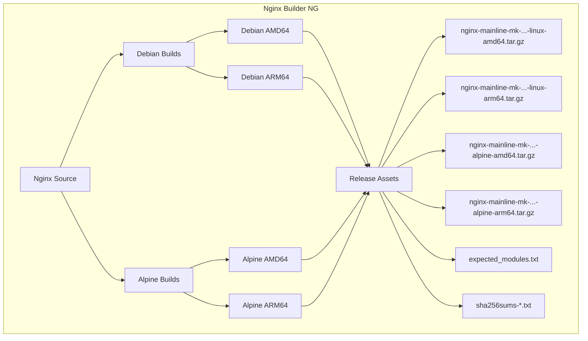

# Nginx Builder NG (Next Generation)

> **Production-ready Nginx builds with advanced modules for modern web infrastructure.**

[](https://github.com/markd3ng/nginx-builder-ng/actions)
[](https://opensource.org/licenses/MIT)

**nginx-builder-ng** is an automated build system that compiles feature-rich Nginx binaries from source with a comprehensive suite of third-party modules. Designed for production environments, it provides optimized builds for both Debian/glibc and Alpine/musl platforms.

## 🎯 Why nginx-builder-ng?

- **Zero Dependency Hell**: All critical modules compiled in, no runtime surprises
- **Production Tested**: Automated CI/CD pipeline with comprehensive testing
- **Multi-Platform**: Native AMD64 and ARM64 support for both Debian and Alpine
- **Always Current**: Tracks Nginx mainline with latest security patches
- **Fully Automated**: Weekly builds ensure you're always up-to-date

## 🚀 Key Features

- **Dual OS Support**: Parallel builds for **Debian (glibc)** and **Alpine Linux (musl libc)**
- **Multi-Architecture**: Native **AMD64 (x86_64)** and **ARM64 (aarch64)** via Docker Buildx
- **Modern Stack**: 
  - **Nginx**: 1.29.4 (Mainline)
  - **OpenSSL**: 3.5.0 (TLS 1.3+)
  - **PCRE2**: 10.42 (with JIT)
  - **Zlib**: 1.3.1
- **Rich Module Set**: 14+ third-party modules including Brotli, Zstd, LuaJIT, GeoIP2, RTMP
- **Automated Testing**: Every build tested in real Alpine and Debian containers
- **Integrity Verified**: SHA256 checksums for all artifacts

## 📦 Included Modules

All builds include the same comprehensive module set:

| Category | Module | Purpose |
| :--- | :--- | :--- |
| **Compression** | Brotli | High-performance compression (Google) |
| | Zstd | Modern real-time compression |
| **Scripting** | LuaJIT | Embed Lua scripts in Nginx config |
| | Echo | Debugging and text output |
| | Set Misc | Additional variables and functions |
| **Security** | Auth PAM | PAM authentication support |
| **Traffic** | GeoIP2 | IP geolocation (MaxMind) |
| | Cache Purge | Selective cache purging |
| | Upload Progress | Track upload status |
| **Features** | Headers More | Advanced header manipulation |
| | Substitutions | Regex-based body replacement |
| | Fancy Index | Beautiful directory listings |
| | RTMP | Live streaming (HLS/RTMP) |
| | DAV Ext | Full WebDAV support |
| | Nchan | Pub/Sub messaging |

**Standard Modules Enabled:**
- HTTP/2, HTTP/3 (QUIC)
- SSL/TLS with OpenSSL 3.5
- Gzip, Gunzip, Gzip Static
- RealIP, Stub Status, Auth Request
- Stream (TCP/UDP proxy)
- Mail proxy (SMTP/POP3/IMAP)

## 🛠️ Architecture



## 📥 Quick Start

### Download Pre-built Binaries

Visit the [Releases page](https://github.com/markd3ng/nginx-builder-ng/releases) to download the latest builds.

**Artifact naming convention:**
```
nginx-mainline-mk-{VERSION}-{BUILD}-{OS}-{ARCH}.tar.gz

Examples:
- nginx-mainline-mk-1.29.4-18-linux-amd64.tar.gz   (Debian x86_64)
- nginx-mainline-mk-1.29.4-18-alpine-amd64.tar.gz  (Alpine x86_64)
- nginx-mainline-mk-1.29.4-18-linux-arm64.tar.gz   (Debian ARM64)
- nginx-mainline-mk-1.29.4-18-alpine-arm64.tar.gz  (Alpine ARM64)
```

### Debian/Ubuntu Installation

```bash
# Download artifact
VERSION="1.29.4"
BUILD="18"
ARCH="amd64"
wget https://github.com/markd3ng/nginx-builder-ng/releases/download/nginx-mainline-mk%2F${VERSION}-${BUILD}/nginx-mainline-mk-${VERSION}-${BUILD}-linux-${ARCH}.tar.gz

# Verify checksum
wget https://github.com/markd3ng/nginx-builder-ng/releases/download/nginx-mainline-mk%2F${VERSION}-${BUILD}/sha256sums-debian-${ARCH}.txt
sha256sum -c sha256sums-debian-${ARCH}.txt --ignore-missing

# Install
sudo tar -xzf nginx-mainline-mk-${VERSION}-${BUILD}-linux-${ARCH}.tar.gz -C /

# Create user if needed
sudo useradd -r -s /bin/false www-data 2>/dev/null || true

# Create directories
sudo mkdir -p /var/log/nginx /var/cache/nginx

# Test
/usr/sbin/nginx -V
```

### Alpine Linux Installation

```bash
# Install runtime dependencies
apk add --no-cache \
    libmaxminddb libxml2 libxslt gd \
    linux-pam zstd-libs pcre2 openssl \
    perl tzdata luajit

# Download artifact
VERSION="1.29.4"
BUILD="18"
ARCH="amd64"
wget https://github.com/markd3ng/nginx-builder-ng/releases/download/nginx-mainline-mk%2F${VERSION}-${BUILD}/nginx-mainline-mk-${VERSION}-${BUILD}-alpine-${ARCH}.tar.gz

# Verify checksum
wget https://github.com/markd3ng/nginx-builder-ng/releases/download/nginx-mainline-mk%2F${VERSION}-${BUILD}/sha256sums-alpine-${ARCH}.txt
sha256sum -c sha256sums-alpine-${ARCH}.txt 2>&1 | grep alpine

# Install
tar -xzf nginx-mainline-mk-${VERSION}-${BUILD}-alpine-${ARCH}.tar.gz -C /

# Create user if needed
addgroup -g 82 -S www-data 2>/dev/null || true
adduser -u 82 -D -S -G www-data www-data 2>/dev/null || true

# Create directories
mkdir -p /var/log/nginx /var/cache/nginx

# Test
/usr/sbin/nginx -V
```

## ⚙️ Usage

### Alpine vs Debian Builds

This project provides two parallel build variants to support different deployment environments:

| Aspect | Debian Build | Alpine Build |
| :--- | :--- | :--- |
| **Base OS** | Debian (Bookworm/Trixie) | Alpine Linux 3.19+ |
| **C Library** | glibc (GNU C Library) | musl libc |
| **Artifact Naming** | `nginx-mainline-mk-{ver}-{build}-linux-{arch}.tar.gz` | `nginx-mainline-mk-{ver}-{build}-alpine-{arch}.tar.gz` |
| **Optimization** | `-O2` (performance) | `-Os` (size) |
| **Binary Size** | Larger (~15-20MB) | Smaller (~12-15MB) |
| **Use Case** | Standard Debian/Ubuntu containers | Alpine-based containers, size-constrained environments |
| **Compatibility** | Most Linux distributions | Alpine Linux, musl-based systems |

**Key Differences:**
- **Alpine builds** use musl libc and are optimized for smaller binary size, making them ideal for minimal container images
- **Debian builds** use glibc and are optimized for performance, suitable for standard Linux environments
- Both variants include the same Nginx modules and feature set
- Both variants use identical component versions (Nginx, OpenSSL, PCRE2, Zlib)

### Consumption in Dockerfile (Debian)

```dockerfile
FROM debian:bookworm-slim

# Set build arguments
ARG VERSION=1.29.4
ARG BUILD=18
ARG ARCH=amd64

# Download and install Nginx
ADD https://github.com/markd3ng/nginx-builder-ng/releases/download/nginx-mainline-mk%2F${VERSION}-${BUILD}/nginx-mainline-mk-${VERSION}-${BUILD}-linux-${ARCH}.tar.gz /tmp/nginx.tar.gz

RUN tar -xzf /tmp/nginx.tar.gz -C / \
    && rm /tmp/nginx.tar.gz \
    && useradd -r -s /bin/false www-data \
    && mkdir -p /var/log/nginx /var/cache/nginx

# Verify installation
RUN /usr/sbin/nginx -V

EXPOSE 80 443
STOPSIGNAL SIGQUIT
CMD ["nginx", "-g", "daemon off;"]
```

### Consumption in Dockerfile (Alpine)

```dockerfile
FROM alpine:3.19

# Set build arguments
ARG VERSION=1.29.4
ARG BUILD=18
ARG ARCH=amd64

# Install runtime dependencies
RUN apk add --no-cache \
    libmaxminddb libxml2 libxslt gd \
    linux-pam zstd-libs pcre2 openssl \
    perl tzdata luajit

# Download and install Nginx
ADD https://github.com/markd3ng/nginx-builder-ng/releases/download/nginx-mainline-mk%2F${VERSION}-${BUILD}/nginx-mainline-mk-${VERSION}-${BUILD}-alpine-${ARCH}.tar.gz /tmp/nginx.tar.gz

RUN tar -xzf /tmp/nginx.tar.gz -C / \
    && rm /tmp/nginx.tar.gz \
    && addgroup -g 82 -S www-data 2>/dev/null || true \
    && adduser -u 82 -D -S -G www-data www-data 2>/dev/null || true \
    && mkdir -p /var/log/nginx /var/cache/nginx

# Verify installation
RUN /usr/sbin/nginx -V

EXPOSE 80 443
STOPSIGNAL SIGQUIT
CMD ["nginx", "-g", "daemon off;"]
```

### Alpine Runtime Dependencies

When deploying Alpine builds, ensure these runtime packages are installed:

| Package | Purpose |
| :--- | :--- |
| `libmaxminddb` | GeoIP2 database support |
| `libxml2` | XML processing |
| `libxslt` | XSLT transformations |
| `gd` | Image processing (GD library) |
| `linux-pam` | PAM authentication |
| `zstd-libs` | Zstd compression |
| `pcre2` | Regular expression support |
| `openssl` | TLS/SSL support |
| `perl` | Perl module support |
| `tzdata` | Timezone data |
| `luajit` | LuaJIT runtime |

### Verifying Artifact Integrity

All releases include SHA256 checksums for verification:

```bash
# For Debian builds
wget https://github.com/markd3ng/nginx-builder-ng/releases/download/nginx-mainline-mk%2F1.29.4-18/sha256sums-debian-amd64.txt
sha256sum -c sha256sums-debian-amd64.txt --ignore-missing

# For Alpine builds
wget https://github.com/markd3ng/nginx-builder-ng/releases/download/nginx-mainline-mk%2F1.29.4-18/sha256sums-alpine-amd64.txt
sha256sum -c sha256sums-alpine-amd64.txt 2>&1 | grep alpine-amd64

# Expected output: nginx-mainline-mk-1.29.4-18-alpine-amd64.tar.gz: OK
```

## 🏗️ Building from Source

### Prerequisites

- Docker with Buildx support
- Git

### Build Commands

```bash
# Clone repository
git clone https://github.com/markd3ng/nginx-builder-ng.git
cd nginx-builder-ng

# Build Debian version (AMD64)
docker buildx build \
  --platform linux/amd64 \
  --build-arg NGINX_VERSION=1.29.4 \
  --output type=local,dest=./output \
  .

# Build Alpine version (AMD64)
docker buildx build \
  --platform linux/amd64 \
  --build-arg NGINX_VERSION=1.29.4 \
  --file Dockerfile.alpine \
  --output type=local,dest=./output \
  .

# Build for ARM64
docker buildx build \
  --platform linux/arm64 \
  --build-arg NGINX_VERSION=1.29.4 \
  --file Dockerfile.alpine \
  --output type=local,dest=./output \
  .
```

### Customizing Versions

Edit `versions.env` to change component versions:

```bash
# Nginx Mainline
NGINX_VERSION="1.29.4"
NGINX_SHA256="..."

# Libraries
OPENSSL_VERSION="3.5.0"
PCRE2_VERSION="10.42"
ZLIB_VERSION="1.3.1"
```

Commit the changes to trigger automated builds via GitHub Actions.

## 🔧 Troubleshooting

### Common Issues

#### 1. Wrong Artifact Type

**Symptom**: Binary fails with "not found" error even though file exists

**Solution**: Ensure you're using the correct artifact for your OS:
- Alpine containers → `*-alpine-*.tar.gz`
- Debian/Ubuntu → `*-linux-*.tar.gz`

```bash
# Check your OS
cat /etc/os-release

# Alpine will show: ID=alpine
# Debian will show: ID=debian
```

#### 2. Missing Runtime Dependencies (Alpine)

**Symptom**: `Error loading shared library libluajit-5.1.so.2`

**Solution**: Install all required runtime packages:
```bash
apk add --no-cache \
    libmaxminddb libxml2 libxslt gd \
    linux-pam zstd-libs pcre2 openssl \
    perl tzdata luajit
```

#### 3. www-data User Missing

**Symptom**: `nginx: [emerg] getpwnam("www-data") failed`

**Solution**: Create the www-data user:
```bash
# Debian/Ubuntu
useradd -r -s /bin/false www-data

# Alpine
addgroup -g 82 -S www-data
adduser -u 82 -D -S -G www-data www-data
```

#### 4. Permission Errors

**Symptom**: Cannot create PID file or log files

**Solution**: Create required directories:
```bash
mkdir -p /var/log/nginx /var/cache/nginx /var/run
chown -R www-data:www-data /var/log/nginx /var/cache/nginx
```

#### 5. Module Verification

**Symptom**: Unsure if all modules are present

**Solution**: Check compiled modules:
```bash
# List all modules
/usr/sbin/nginx -V 2>&1 | grep -o 'with-[^ ]*'

# Download expected modules list
wget https://github.com/markd3ng/nginx-builder-ng/releases/download/nginx-mainline-mk%2F1.29.4-18/expected_modules.txt

# Verify
/usr/sbin/nginx -V 2>&1 | grep -f expected_modules.txt
```

### Detailed Troubleshooting

For comprehensive Alpine-specific troubleshooting, see [Alpine Troubleshooting Guide](docs/ALPINE_TROUBLESHOOTING.md).

## 🤝 Contributing

Contributions are welcome! Please feel free to submit a Pull Request.

### Development Workflow

1. Fork the repository
2. Create a feature branch (`git checkout -b feature/amazing-feature`)
3. Make your changes
4. Test locally with Docker
5. Commit your changes (`git commit -m 'Add amazing feature'`)
6. Push to the branch (`git push origin feature/amazing-feature`)
7. Open a Pull Request

### Reporting Issues

When reporting issues, please include:
- OS and architecture (Debian/Alpine, AMD64/ARM64)
- Nginx version and build number
- Full error message
- Output of `/usr/sbin/nginx -V`
- Output of `ldd /usr/sbin/nginx` (for library issues)

## 📊 CI/CD Pipeline

This project uses GitHub Actions for automated builds:

- **Trigger**: Push to master, weekly schedule, or manual dispatch
- **Build Matrix**: 2 OS types × 2 architectures = 4 parallel builds
- **Testing**: Automated tests in real Alpine and Debian containers
- **Release**: Automatic GitHub Releases with all artifacts and checksums

View the [latest builds](https://github.com/markd3ng/nginx-builder-ng/actions).

## 📝 License

MIT License - see [LICENSE](LICENSE) file for details.

## 🙏 Acknowledgments

Built with components from:
- [Nginx](https://nginx.org/) - High-performance HTTP server
- [OpenSSL](https://www.openssl.org/) - Cryptography and SSL/TLS toolkit
- [OpenResty](https://openresty.org/) - LuaJIT and Lua modules
- All third-party module authors

## 📮 Support

- **Issues**: [GitHub Issues](https://github.com/markd3ng/nginx-builder-ng/issues)
- **Discussions**: [GitHub Discussions](https://github.com/markd3ng/nginx-builder-ng/discussions)
- **Documentation**: [docs/](docs/)

---

**Note**: This project tracks Nginx mainline releases. For stable releases, check the tags or use specific version numbers.
