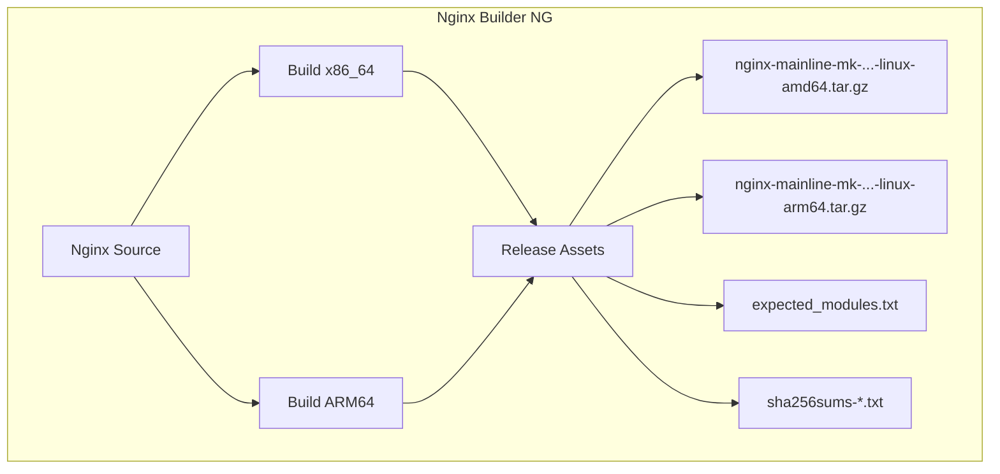

# Nginx Builder NG (Next Generation)

> **The engine room for the modern Nginx Proxy Manager ecosystem.**

[](https://github.com/markd3ng/nginx-builder-ng/actions)

**nginx-builder-ng** is a specialized build system that compiles a "fat" Nginx binary from source. It is designed to provide a feature-rich, high-performance Nginx core for downstream projects like [nginx-proxy-manager-app](https://github.com/markd3ng/nginx-proxy-manager-app).

Unlike standard distribution packages (`apt-get install nginx`), this builder produces a statically compiled binary packed with numerous 3rd-party modules that are critical for advanced proxying, security, and performance.

## 🚀 Key Features

*   **Static Compilation**: Critical modules (Brotli, Zstd, ModSecurity, LuaJIT) are compiled directly into the binary or verified dynamic libraries, ensuring zero dependency hell at runtime.
*   **Modern Stack**: Builds against:
    *   **Nginx**: Mainline (Rolling Release)
    *   **OpenSSL**: 3.x (with TLS 1.3+ optimizations)
    *   **PCRE2**: Enabled with JIT support
*   **Multi-Architecture**: Native support for **AMD64 (x86_64)** and **ARM64 (aarch64)** via Docker Buildx.
*   **Self-Describing**: Generates a signature file (`expected_modules.txt`) that downstream pipelines use to verify capability integrity before deployment.
*   **Docker Optimized**: Output is a tarball specifically structured for layering into lightweight Distroless or Slim Debian Docker images.

## 📦 Included Modules

This builder includes a comprehensive suite of modules:

| Category | Module | Repository | Purpose |
| :--- | :--- | :--- | :--- |
| **Compression** | **Brotli** | `google/ngx_brotli` | High-performance compression algorithm. |
| | **Zstd** | `tokers/zstd-nginx-module` | Modern real-time compression fast standard. |
| **Scripting** | **LuaJIT** | `openresty/lua-nginx-module` | Embed Lua scripts in Nginx config. |
| | **Echo** | `openresty/echo-nginx-module` | Debugging and shell-style text output in responses. |
| **Security** | **Auth PAM** | `sto/ngx_http_auth_pam_module` | PAM authentication support. |
| **Traffic** | **GeoIP2** | `leev/ngx_http_geoip2_module` | IP geolocation support (MaxMind). |
| | **Cache Purge** | `nginx-modules/ngx_cache_purge` | Selective content cache purging. |
| | **Upload Progress** | `masterzen/nginx-upload-progress-module` | Track upload status for UI. |
| **Features** | **Headers More** | `openresty/headers-more-nginx-module` | Set/Clear any headers (input/output). |
| | **Substitutions** | `yaoweibin/ngx_http_substitutions_filter_module` | Regex-based response body replacement. |
| | **Fancy Index** | `aperezdc/ngx-fancyindex` | Beautiful directory listings. |
| | **RTMP** | `arut/nginx-rtmp-module` | Live streaming (HLS/RTMP) support. |
| | **DAV Ext** | `arut/nginx-dav-ext-module` | Full WebDAV support (PUT, DELETE, MKCOL, etc). |
| | **Nchan** | `slact/nchan` | Flexible Pub/Sub server. |

## 🛠️ Architecture



## ⚙️ Usage

### Consumption in Dockerfile

To use the artifacts from this builder in your own project:

```dockerfile
# Example Dockerfile
# TAG format: nginx-mainline-mk/{VERSION}-{RUN_NUMBER}
ARG RELEASE_TAG=nginx-mainline-mk%2F1.29.4-40
ARG VERSION=1.29.4
ARG RUN_NUM=40
ARG ARCH=amd64

FROM debian:bookworm-slim

# Download Artifacts (Dynamic Filename)
ADD https://github.com/markd3ng/nginx-builder-ng/releases/download/${RELEASE_TAG}/nginx-mainline-mk-${VERSION}-${RUN_NUM}-linux-${ARCH}.tar.gz /tmp/nginx.tar.gz

# Install
RUN tar -xzf /tmp/nginx.tar.gz -C / \
    && rm /tmp/nginx.tar.gz \
    && useradd -r -s /bin/false www-data \
    && mkdir -p /var/log/nginx /var/cache/nginx
```

## 📝 License

MIT License. See [LICENSE](LICENSE) file.

Based on work from the Open Source Nginx community.
