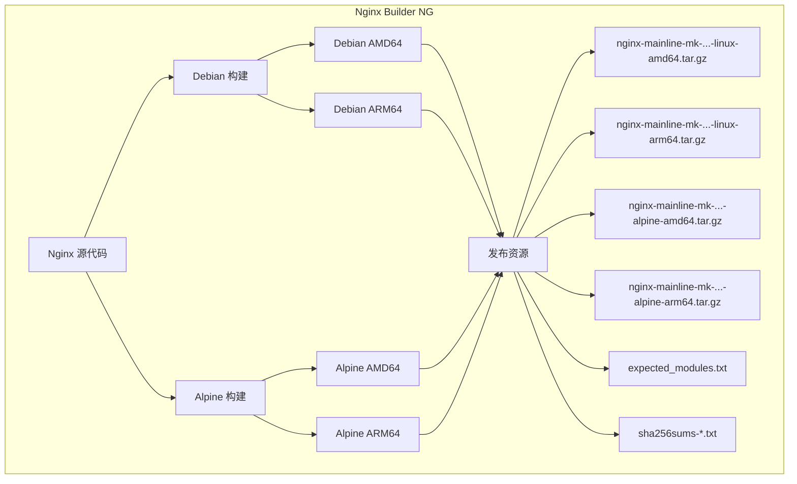

# Nginx Builder NG (下一代)

> **生产就绪的 Nginx 构建版本，集成高级模块，适用于现代 Web 基础设施。**

[](https://github.com/markd3ng/nginx-builder-ng/actions)
[](https://opensource.org/licenses/MIT)

[English](README.md) | 简体中文

**nginx-builder-ng** 是一个自动化构建系统，从源代码编译功能丰富的 Nginx 二进制文件，集成了全面的第三方模块套件。专为生产环境设计，为 Debian/glibc 和 Alpine/musl 平台提供优化构建版本。

## 🎯 为什么选择 nginx-builder-ng？

- **零依赖地狱**：所有关键模块内置编译，无运行时意外
- **生产环境测试**：自动化 CI/CD 流水线，全面测试
- **多平台支持**：原生支持 AMD64 和 ARM64 架构的 Debian 和 Alpine
- **始终最新**：跟踪 Nginx 主线版本，包含最新安全补丁
- **全自动化**：每周构建确保您始终保持最新

## 🚀 核心特性

- **双系统支持**：并行构建 **Debian (glibc)** 和 **Alpine Linux (musl libc)**
- **多架构**：通过 Docker Buildx 原生支持 **AMD64 (x86_64)** 和 **ARM64 (aarch64)**
- **现代技术栈**：
  - **Nginx**: 1.29.4 (主线版本)
  - **OpenSSL**: 3.5.0 (TLS 1.3+)
  - **PCRE2**: 10.42 (支持 JIT)
  - **Zlib**: 1.3.1
- **丰富的模块集**：14+ 个第三方模块，包括 Brotli、Zstd、LuaJIT、GeoIP2、RTMP
- **自动化测试**：每个构建都在真实的 Alpine 和 Debian 容器中测试
- **完整性验证**：所有构建产物提供 SHA256 校验和

## 📦 包含的模块

所有构建版本都包含相同的全面模块集：

| 类别 | 模块 | 用途 |
| :--- | :--- | :--- |
| **压缩** | Brotli | 高性能压缩（Google） |
| | Zstd | 现代实时压缩 |
| **脚本** | LuaJIT | 在 Nginx 配置中嵌入 Lua 脚本 |
| | Echo | 调试和文本输出 |
| | Set Misc | 额外的变量和函数 |
| **安全** | Auth PAM | PAM 认证支持 |
| **流量** | GeoIP2 | IP 地理定位（MaxMind） |
| | Cache Purge | 选择性缓存清除 |
| | Upload Progress | 跟踪上传状态 |
| **功能** | Headers More | 高级请求头操作 |
| | Substitutions | 基于正则的内容替换 |
| | Fancy Index | 美化的目录列表 |
| | RTMP | 直播流（HLS/RTMP） |
| | DAV Ext | 完整的 WebDAV 支持 |
| | Nchan | 发布/订阅消息 |

**启用的标准模块：**
- HTTP/2、HTTP/3 (QUIC)
- SSL/TLS with OpenSSL 3.5
- Gzip、Gunzip、Gzip Static
- RealIP、Stub Status、Auth Request
- Stream（TCP/UDP 代理）
- Mail 代理（SMTP/POP3/IMAP）

## 🛠️ 架构



## 📥 快速开始

### 下载预构建二进制文件

访问 [Releases 页面](https://github.com/markd3ng/nginx-builder-ng/releases) 下载最新构建版本。

**构建产物命名规则：**
```
nginx-mainline-mk-{VERSION}-{BUILD}-{OS}-{ARCH}.tar.gz

示例：
- nginx-mainline-mk-1.29.4-18-linux-amd64.tar.gz   (Debian x86_64)
- nginx-mainline-mk-1.29.4-18-alpine-amd64.tar.gz  (Alpine x86_64)
- nginx-mainline-mk-1.29.4-18-linux-arm64.tar.gz   (Debian ARM64)
- nginx-mainline-mk-1.29.4-18-alpine-arm64.tar.gz  (Alpine ARM64)
```

### Debian/Ubuntu 安装

```bash
# 下载构建产物
VERSION="1.29.4"
BUILD="18"
ARCH="amd64"
wget https://github.com/markd3ng/nginx-builder-ng/releases/download/nginx-mainline-mk%2F${VERSION}-${BUILD}/nginx-mainline-mk-${VERSION}-${BUILD}-linux-${ARCH}.tar.gz

# 验证校验和
wget https://github.com/markd3ng/nginx-builder-ng/releases/download/nginx-mainline-mk%2F${VERSION}-${BUILD}/sha256sums-debian-${ARCH}.txt
sha256sum -c sha256sums-debian-${ARCH}.txt --ignore-missing

# 安装
sudo tar -xzf nginx-mainline-mk-${VERSION}-${BUILD}-linux-${ARCH}.tar.gz -C /

# 如需要，创建用户
sudo useradd -r -s /bin/false www-data 2>/dev/null || true

# 创建目录
sudo mkdir -p /var/log/nginx /var/cache/nginx

# 测试
/usr/sbin/nginx -V
```

### Alpine Linux 安装

```bash
# 安装运行时依赖
apk add --no-cache \
    libmaxminddb libxml2 libxslt gd \
    linux-pam zstd-libs pcre2 openssl \
    perl tzdata luajit

# 下载构建产物
VERSION="1.29.4"
BUILD="18"
ARCH="amd64"
wget https://github.com/markd3ng/nginx-builder-ng/releases/download/nginx-mainline-mk%2F${VERSION}-${BUILD}/nginx-mainline-mk-${VERSION}-${BUILD}-alpine-${ARCH}.tar.gz

# 验证校验和
wget https://github.com/markd3ng/nginx-builder-ng/releases/download/nginx-mainline-mk%2F${VERSION}-${BUILD}/sha256sums-alpine-${ARCH}.txt
sha256sum -c sha256sums-alpine-${ARCH}.txt 2>&1 | grep alpine

# 安装
tar -xzf nginx-mainline-mk-${VERSION}-${BUILD}-alpine-${ARCH}.tar.gz -C /

# 如需要，创建用户
addgroup -g 82 -S www-data 2>/dev/null || true
adduser -u 82 -D -S -G www-data www-data 2>/dev/null || true

# 创建目录
mkdir -p /var/log/nginx /var/cache/nginx

# 测试
/usr/sbin/nginx -V
```

## ⚙️ 使用说明

### Alpine vs Debian 构建版本

本项目提供两种并行构建变体，以支持不同的部署环境：

| 方面 | Debian 构建 | Alpine 构建 |
| :--- | :--- | :--- |
| **基础系统** | Debian (Bookworm/Trixie) | Alpine Linux 3.19+ |
| **C 库** | glibc (GNU C Library) | musl libc |
| **产物命名** | `nginx-mainline-mk-{ver}-{build}-linux-{arch}.tar.gz` | `nginx-mainline-mk-{ver}-{build}-alpine-{arch}.tar.gz` |
| **优化** | `-O2` (性能) | `-Os` (体积) |
| **二进制大小** | 较大 (~15-20MB) | 较小 (~12-15MB) |
| **使用场景** | 标准 Debian/Ubuntu 容器 | Alpine 容器、体积受限环境 |
| **兼容性** | 大多数 Linux 发行版 | Alpine Linux、基于 musl 的系统 |

**主要区别：**
- **Alpine 构建**使用 musl libc，针对更小的二进制体积优化，非常适合最小化容器镜像
- **Debian 构建**使用 glibc，针对性能优化，适合标准 Linux 环境
- 两种变体包含相同的 Nginx 模块和功能集
- 两种变体使用相同的组件版本（Nginx、OpenSSL、PCRE2、Zlib）

### 在 Dockerfile 中使用（Debian）

```dockerfile
FROM debian:bookworm-slim

# 设置构建参数
ARG VERSION=1.29.4
ARG BUILD=18
ARG ARCH=amd64

# 下载并安装 Nginx
ADD https://github.com/markd3ng/nginx-builder-ng/releases/download/nginx-mainline-mk%2F${VERSION}-${BUILD}/nginx-mainline-mk-${VERSION}-${BUILD}-linux-${ARCH}.tar.gz /tmp/nginx.tar.gz

RUN tar -xzf /tmp/nginx.tar.gz -C / \
    && rm /tmp/nginx.tar.gz \
    && useradd -r -s /bin/false www-data \
    && mkdir -p /var/log/nginx /var/cache/nginx

# 验证安装
RUN /usr/sbin/nginx -V

EXPOSE 80 443
STOPSIGNAL SIGQUIT
CMD ["nginx", "-g", "daemon off;"]
```

### 在 Dockerfile 中使用（Alpine）

```dockerfile
FROM alpine:3.19

# 设置构建参数
ARG VERSION=1.29.4
ARG BUILD=18
ARG ARCH=amd64

# 安装运行时依赖
RUN apk add --no-cache \
    libmaxminddb libxml2 libxslt gd \
    linux-pam zstd-libs pcre2 openssl \
    perl tzdata luajit

# 下载并安装 Nginx
ADD https://github.com/markd3ng/nginx-builder-ng/releases/download/nginx-mainline-mk%2F${VERSION}-${BUILD}/nginx-mainline-mk-${VERSION}-${BUILD}-alpine-${ARCH}.tar.gz /tmp/nginx.tar.gz

RUN tar -xzf /tmp/nginx.tar.gz -C / \
    && rm /tmp/nginx.tar.gz \
    && addgroup -g 82 -S www-data 2>/dev/null || true \
    && adduser -u 82 -D -S -G www-data www-data 2>/dev/null || true \
    && mkdir -p /var/log/nginx /var/cache/nginx

# 验证安装
RUN /usr/sbin/nginx -V

EXPOSE 80 443
STOPSIGNAL SIGQUIT
CMD ["nginx", "-g", "daemon off;"]
```

### Alpine 运行时依赖

部署 Alpine 构建版本时，请确保安装以下运行时包：

| 包名 | 用途 |
| :--- | :--- |
| `libmaxminddb` | GeoIP2 数据库支持 |
| `libxml2` | XML 处理 |
| `libxslt` | XSLT 转换 |
| `gd` | 图像处理（GD 库） |
| `linux-pam` | PAM 认证 |
| `zstd-libs` | Zstd 压缩 |
| `pcre2` | 正则表达式支持 |
| `openssl` | TLS/SSL 支持 |
| `perl` | Perl 模块支持 |
| `tzdata` | 时区数据 |
| `luajit` | LuaJIT 运行时 |

### 验证构建产物完整性

所有发布版本都包含 SHA256 校验和用于验证：

```bash
# Debian 构建
wget https://github.com/markd3ng/nginx-builder-ng/releases/download/nginx-mainline-mk%2F1.29.4-18/sha256sums-debian-amd64.txt
sha256sum -c sha256sums-debian-amd64.txt --ignore-missing

# Alpine 构建
wget https://github.com/markd3ng/nginx-builder-ng/releases/download/nginx-mainline-mk%2F1.29.4-18/sha256sums-alpine-amd64.txt
sha256sum -c sha256sums-alpine-amd64.txt 2>&1 | grep alpine-amd64

# 预期输出：nginx-mainline-mk-1.29.4-18-alpine-amd64.tar.gz: OK
```

## 🏗️ 从源代码构建

### 前置要求

- 支持 Buildx 的 Docker
- Git

### 构建命令

```bash
# 克隆仓库
git clone https://github.com/markd3ng/nginx-builder-ng.git
cd nginx-builder-ng

# 构建 Debian 版本（AMD64）
docker buildx build \
  --platform linux/amd64 \
  --build-arg NGINX_VERSION=1.29.4 \
  --output type=local,dest=./output \
  .

# 构建 Alpine 版本（AMD64）
docker buildx build \
  --platform linux/amd64 \
  --build-arg NGINX_VERSION=1.29.4 \
  --file Dockerfile.alpine \
  --output type=local,dest=./output \
  .

# 构建 ARM64 版本
docker buildx build \
  --platform linux/arm64 \
  --build-arg NGINX_VERSION=1.29.4 \
  --file Dockerfile.alpine \
  --output type=local,dest=./output \
  .
```

### 自定义版本

编辑 `versions.env` 来更改组件版本：

```bash
# Nginx 主线版本
NGINX_VERSION="1.29.4"
NGINX_SHA256="..."

# 库
OPENSSL_VERSION="3.5.0"
PCRE2_VERSION="10.42"
ZLIB_VERSION="1.3.1"
```

提交更改以通过 GitHub Actions 触发自动构建。

## 🔧 故障排除

### 常见问题

#### 1. 错误的构建产物类型

**症状**：二进制文件失败，显示"未找到"错误，即使文件存在

**解决方案**：确保您使用的是适合您操作系统的正确构建产物：
- Alpine 容器 → `*-alpine-*.tar.gz`
- Debian/Ubuntu → `*-linux-*.tar.gz`

```bash
# 检查您的操作系统
cat /etc/os-release

# Alpine 会显示：ID=alpine
# Debian 会显示：ID=debian
```

#### 2. 缺少运行时依赖（Alpine）

**症状**：`Error loading shared library libluajit-5.1.so.2`

**解决方案**：安装所有必需的运行时包：
```bash
apk add --no-cache \
    libmaxminddb libxml2 libxslt gd \
    linux-pam zstd-libs pcre2 openssl \
    perl tzdata luajit
```

#### 3. www-data 用户缺失

**症状**：`nginx: [emerg] getpwnam("www-data") failed`

**解决方案**：创建 www-data 用户：
```bash
# Debian/Ubuntu
useradd -r -s /bin/false www-data

# Alpine
addgroup -g 82 -S www-data
adduser -u 82 -D -S -G www-data www-data
```

#### 4. 权限错误

**症状**：无法创建 PID 文件或日志文件

**解决方案**：创建所需目录：
```bash
mkdir -p /var/log/nginx /var/cache/nginx /var/run
chown -R www-data:www-data /var/log/nginx /var/cache/nginx
```

#### 5. 模块验证

**症状**：不确定是否所有模块都存在

**解决方案**：检查编译的模块：
```bash
# 列出所有模块
/usr/sbin/nginx -V 2>&1 | grep -o 'with-[^ ]*'

# 下载预期模块列表
wget https://github.com/markd3ng/nginx-builder-ng/releases/download/nginx-mainline-mk%2F1.29.4-18/expected_modules.txt

# 验证
/usr/sbin/nginx -V 2>&1 | grep -f expected_modules.txt
```

### 详细故障排除

有关 Alpine 特定的全面故障排除，请参阅 [Alpine 故障排除指南](docs/ALPINE_TROUBLESHOOTING.md)。

## 🤝 贡献

欢迎贡献！请随时提交 Pull Request。

### 开发工作流

1. Fork 仓库
2. 创建功能分支（`git checkout -b feature/amazing-feature`）
3. 进行更改
4. 使用 Docker 本地测试
5. 提交更改（`git commit -m 'Add amazing feature'`）
6. 推送到分支（`git push origin feature/amazing-feature`）
7. 打开 Pull Request

### 报告问题

报告问题时，请包含：
- 操作系统和架构（Debian/Alpine、AMD64/ARM64）
- Nginx 版本和构建编号
- 完整的错误消息
- `/usr/sbin/nginx -V` 的输出
- `ldd /usr/sbin/nginx` 的输出（用于库问题）

## 📊 CI/CD 流水线

本项目使用 GitHub Actions 进行自动化构建：

- **触发器**：推送到 master、每周计划或手动调度
- **构建矩阵**：2 种操作系统 × 2 种架构 = 4 个并行构建
- **测试**：在真实的 Alpine 和 Debian 容器中自动化测试
- **发布**：自动创建 GitHub Releases，包含所有构建产物和校验和

查看[最新构建](https://github.com/markd3ng/nginx-builder-ng/actions)。

## 📝 许可证

MIT 许可证 - 详见 [LICENSE](LICENSE) 文件。

## 🙏 致谢

使用以下组件构建：
- [Nginx](https://nginx.org/) - 高性能 HTTP 服务器
- [OpenSSL](https://www.openssl.org/) - 加密和 SSL/TLS 工具包
- [OpenResty](https://openresty.org/) - LuaJIT 和 Lua 模块
- 所有第三方模块作者

## 📮 支持

- **问题**：[GitHub Issues](https://github.com/markd3ng/nginx-builder-ng/issues)
- **讨论**：[GitHub Discussions](https://github.com/markd3ng/nginx-builder-ng/discussions)
- **文档**：[docs/](docs/)

---

**注意**：本项目跟踪 Nginx 主线版本。对于稳定版本，请查看标签或使用特定版本号。
